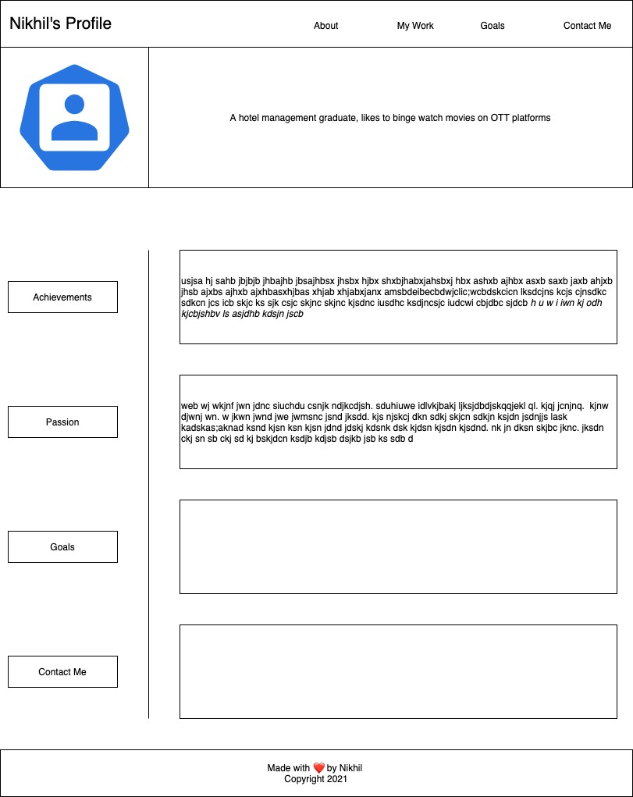

# Personal Portfolio

## Purpose
A website having my personal portfolio 

## Built With
* HTML
* CSS

## Git Hub Repository
https://github.com/nnikhil84/nikhil-portfolio.github.io

## Deployed Website
https://nnikhil84.github.io/nikhil-portfolio.github.io/

## Task Achieved
* Prepared HTML Boilerplate
* Made outline of the website using wireframing as per below image

* Prepared index.html as per the above outline
* Created the style.css which is the main styling file
* Created Develop branch
* Worked in following feature branches in chronological order
1. hero-styling
2. style-main-content
3. style-footer
4. added-styling - for additional styling 
5. pseudo-classes
6. media-queries
* Once each feature was completed, merged them into develop branch
* Once all features completed and merged into develop branch, merged the develop branch into main branch and pushed the same to git hub repository
* Completed README.md
* Final commit with completed README.md 

## Resources Used
* Button: https://css3buttongenerator.com/
* Flex: https://css-tricks.com/snippets/css/a-guide-to-flexbox/
* Color Pallets: https://colorhunt.co/

## Screenshots of completed web application in various widths

